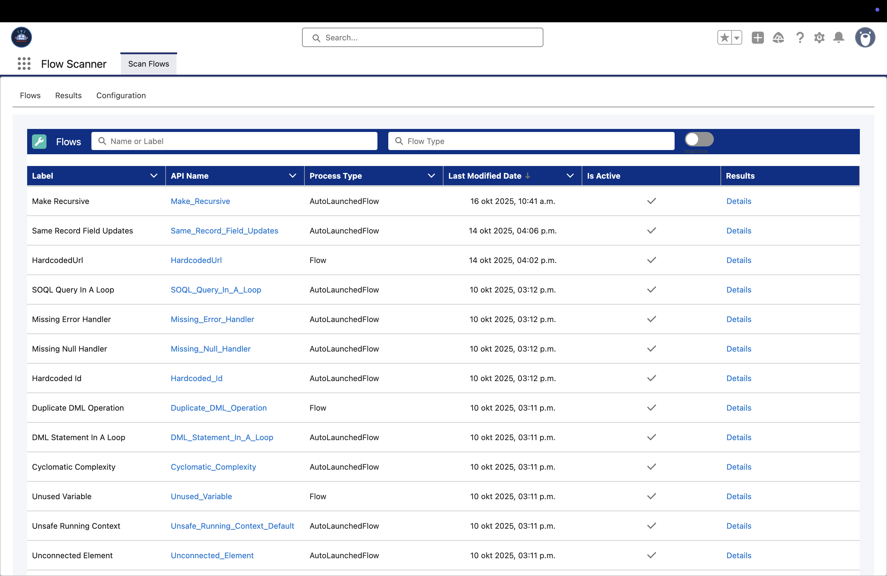
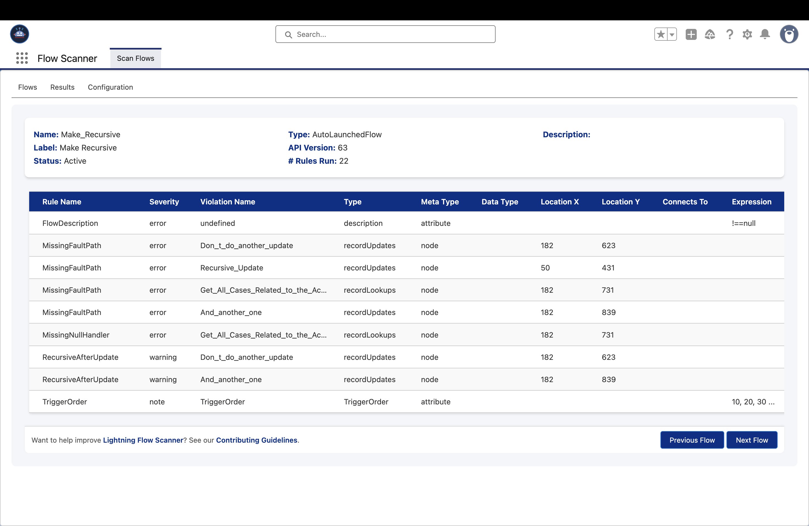
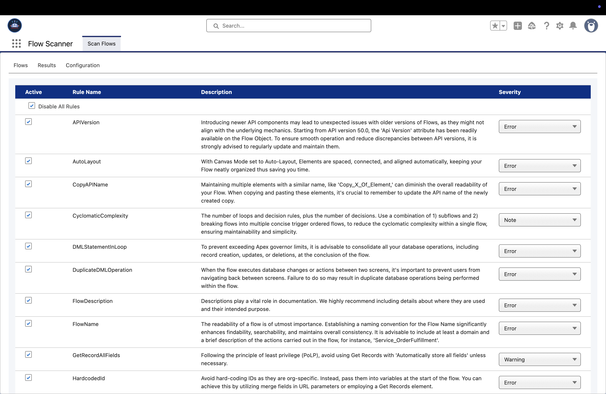

<p align="center">
 <a href="https://github.com/Flow-Scanner">
 
 </a>
</p>

<p align="center">Scans for unsafe contexts, hardcoded IDs, and other issues to optimize your Flows.</p>

<p align="center">
 
</p>

## Features

**Lightning Flow Scanner App** integrates the Lightning Flow Scanner as a UMD module within Salesforce, enabling scanning of flow metadata for 20+ issues such as hardcoded IDs, unsafe contexts, inefficient SOQL/DML operations, recursion risks, and missing fault handling.

For details about all available rules, their default severities, and configuration options, visit the [Flow Scanner Documentation](https://flow-scanner.github.io/lightning-flow-scanner-core/).

### Flow Overview:

<p align="center">
 
</p>

### Violation Details:

<p align="center">
 
</p>

### Rule Configuration:

<p align="center">
 
</p>

## Installation

<a href="https://login.salesforce.com/packaging/installPackage.apexp?p0=04tgK0000006ikjQAA">
  
</a>

Or via Salesforce CLI:

```bash
sf package install --package lightning-flow-scanner@2.8.0 --target-org <OrgAlias> --wait 10
```

## Usage

- *Prerequisite: Ensure that the Flow Scanner permission set is assigned to users who need access.*
- Click on the App Launcher icon in the top-left corner of your Salesforce interface.
- Search for "Flow Scanner" in the App Launcher.
- Click on the "Flow Scanner" app to open the Scan Flows Overview.
- (Optional) Configure rules in the Configuration tab.
- View results of a Flow by clicking "details".

## Configuration

While no configuration is required, Admins can define **default severities**, **expressions**, or **disabled states** for scan rules using the `ScanRuleConfiguration__mdt` custom metadata type. These overrides apply globally for all users in the org, but individual users can still adjust severities or disable rules locally in the browser — those changes only persist for their current session. For a more on configurations, review the [documentation](https://flow-scanner.github.io/lightning-flow-scanner-core/#configurations).

### To Create an Override

1. Go to **Setup → Custom Metadata Types → ScanRuleConfiguration → Manage Records**
2. Click **New** and set the following fields:
   - **Rule Name** — must match the rule’s API name (e.g., `FlowName`)
   - **Severity** — `Error`, `Warning`, `Info`, or `Note`
   - **Expression** *(optional)* — e.g., `[A-Za-z]+_[0-9]+`
   - **Disabled** — check to turn off the rule globally
3. Once saved, the **Flow Scanner App** automatically applies these overrides at load time — no user configuration needed.

<p align="center">
 
</p>

## Development

1) Clone this repository:

```sh
git clone https://github.com/Flow-Scanner/lightning-flow-scanner-app.git
```

2) Authorize your Salesforce org to set up a connection with your local development environment:

```sh
sf login web --set-default --alias <YourOrgAlias>
```

3) Push Source to Your Org:

```sh
sf project:deploy:start
```

4) Assign Permission Set

```sh
sf org assign permset --name flow_scanner__Flow_Scanner
```

4) Pull Modifications from Your Org:

```sh
sf project sync
```

Want to help improve [Lightning Flow Scanner](https://flow-scanner.github.io/lightning-flow-scanner-core/)? See our [Contributing Guidelines](https://github.com/Flow-Scanner/lightning-flow-scanner-core?tab=contributing-ov-file).
