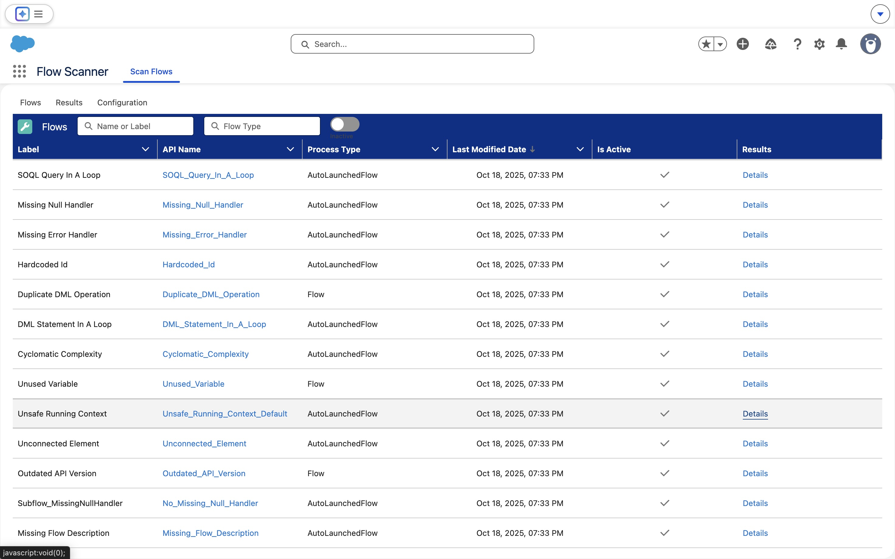
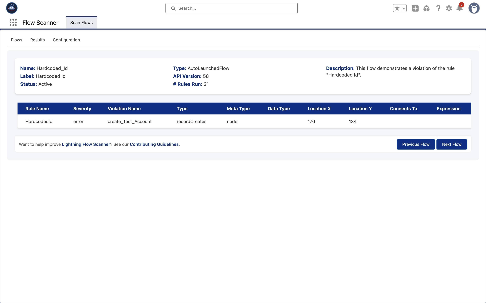

<p align="center">
 <a href="https://github.com/Flow-Scanner">
 
 </a>
</p>

<p align="center">Scans for unsafe contexts, hardcoded IDs, and other issues to optimize your Flows.</p>

<p align="center">
 
</p>

## Features

**Lightning Flow Scanner App** integrates the Lightning Flow Scanner as a UMD module within Salesforce, enabling scanning of flow metadata. The app runs predefined rules and presents detailed scan results for flows, including violation details, severity levels, and relevant flow metadata.

### Flow Overview:
<p align="center">
 
</p>

### Violation Details:
<p align="center">
 
</p>

### Rule Configuration:
<p align="center">
 
</p>

## Installation

<a href="https://githubsfdeploy.herokuapp.com?owner=Flow-Scanner&repo=lightning-flow-scanner-app&ref=main">
 
</a>

## Usage

1) Make sure the `LFSApp` permission set is assigned to any user that requires access to the flow scanner.
2) Open the App:
   - Click on the App Launcher icon in the top-left corner of your Salesforce interface.
   - Search for "Flow Scanner" in the App Launcher search bar.
   - Click on the "Flow Scanner" app to open it.
3) View results of a Flow by clicking "details".

## Development

1) Clone this repository:
```sh
git clone https://github.com/Flow-Scanner/lightning-flow-scanner-app.git
```

2) Authorize your Salesforce org to set up a connection with your local development environment:
```sh
sf login web --set-default --alias <YourOrgAlias>
```

3) Push Source to Your Org:
```sh
sf project:deploy:start
```

4) Pull Modifications from Your Org:
```sh
sf project sync
```

Want to help improve [Lightning Flow Scanner](https://flow-scanner.github.io/lightning-flow-scanner-core/)? See our [Contributing Guidelines](https://github.com/Flow-Scanner/lightning-flow-scanner-core/blob/main/CONTRIBUTING.md).