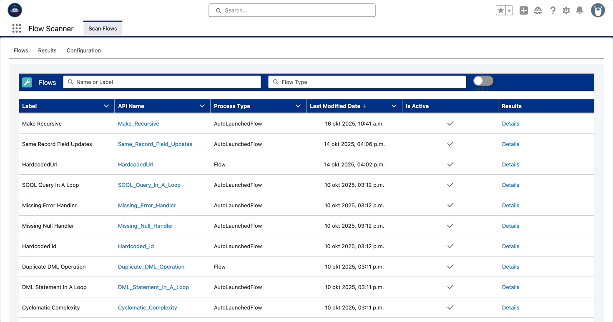
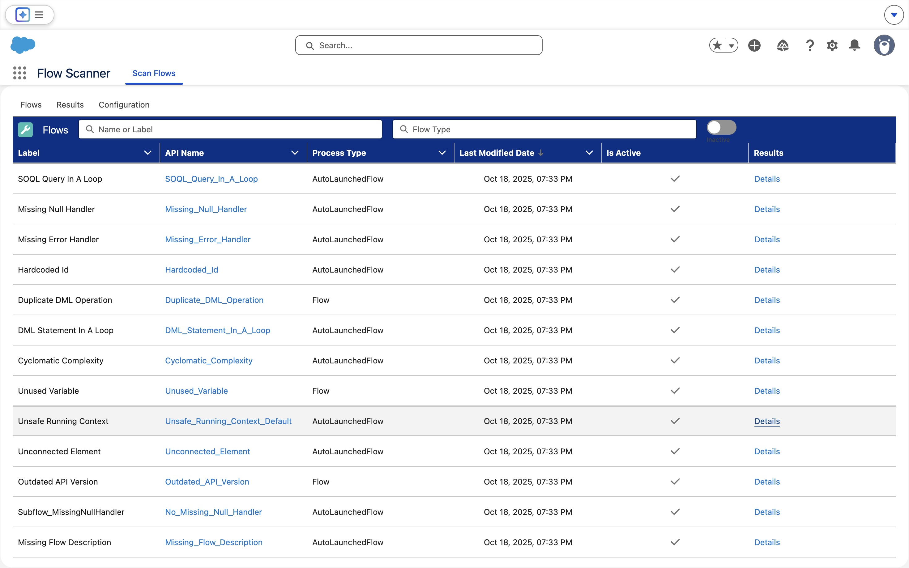
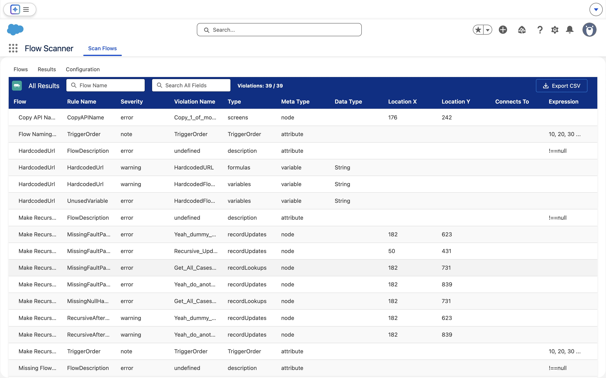
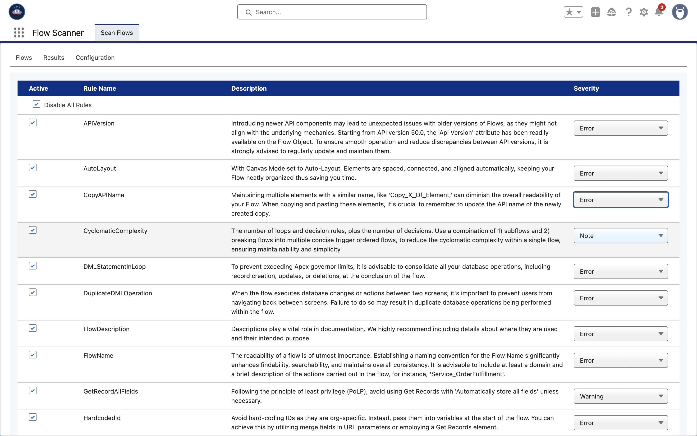
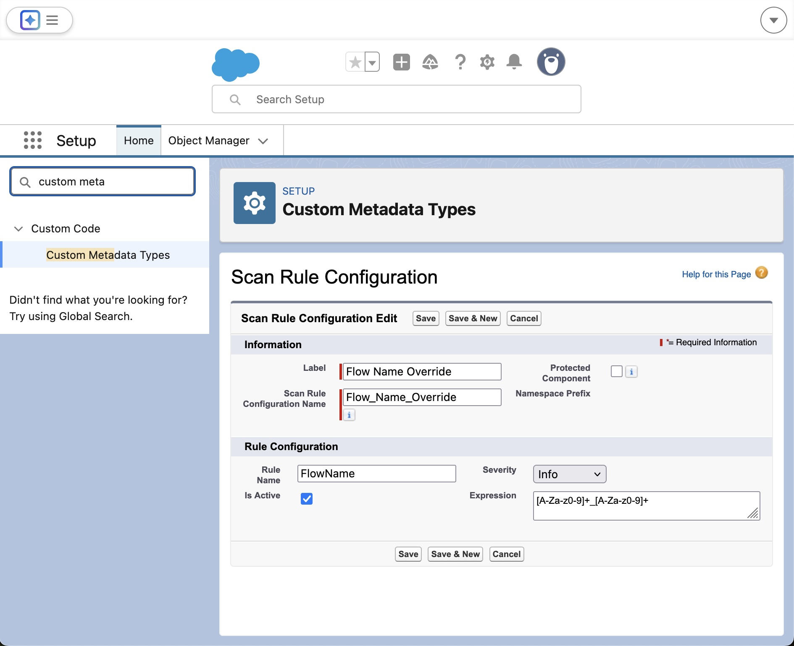

<p align="center">
 <a href="https://github.com/Flow-Scanner">
 
 </a>
</p>
<p align="center"><em>Detect unsafe contexts, queries in loops, hardcoded IDs, and more to optimize Salesforce Flows.</em></p>

<p align="center">
 
</p>

---

## Table of contents

- **[Features](#features)**
- **[Usage](#usage)**
- **[Configuration](#configuration)**
- **[Installation](#installation)**
- **[Development](#development)**

---

## Features

### Flow Overview

<p align="center">
 
</p>

### Violation Details

<p align="center">
  
</p>

### Rule Configuration:

<p align="center">
 
</p>

## Usage

**Lightning Flow Scanner App** integrates the Lightning Flow Scanner as a UMD module within Salesforce, enabling scanning of flow metadata for 20+ issues such as hardcoded IDs, unsafe contexts, inefficient SOQL/DML operations, recursion risks, and missing fault handling.

- Click on the App Launcher icon in the top-left corner of your Salesforce interface.
- Search for "Flow Scanner" in the App Launcher.
- Click on the "Flow Scanner" app to open the Scan Flows Overview.
- (Optional) Configure rules in the Configuration tab.
- View results of a Flow by clicking "details".

For details about all available rules, their default severities, and configuration options, visit the [Flow Scanner Documentation](https://flow-scanner.github.io/lightning-flow-scanner/).

**Privacy:** Zero user data collected. All processing is client-side. → See Data Handling in our [Security Policy](https://github.com/Flow-Scanner/lightning-flow-scanner-app?tab=security-ov-file).

---

## Configuration

While no configuration is required, you can configure rules in three ways. Session and imported settings apply for the current browser session only. For full config reference, see the [documentation](https://flow-scanner.github.io/lightning-flow-scanner/#configurations).

### Org defaults (Custom Metadata)

Admins can define **default severities**, **expressions**, or **disabled states** for scan rules using the `ScanRuleConfiguration__mdt` custom metadata type. These overrides apply globally for all users in the org; individual users can still adjust severities or disable rules locally in the browser.

1. Go to **Setup → Custom Metadata Types → ScanRuleConfiguration → Manage Records**
2. Click **New** and set the following fields:

- **Rule Name** — legacy name (e.g. `FlowName`) or canonical rule id (e.g. `invalid-naming-convention`)
- **Severity** — `Error`, `Warning`, `Info`, or `Note`
- **Expression** *(optional)* — e.g., `[A-Za-z]+_[0-9]+`
- **Disabled** — check to turn off the rule globally

3. Once saved, the **Flow Scanner App** automatically applies these overrides at load time.

<p align="center">
 
</p>

### Import JSON (same format as CLI / VS Code)

On the **Configuration** tab, use **Load JSON config** to import a `.flow-scanner.json` file (or any JSON using the same schema the CLI and VS Code extension read). Supported:

- Per-rule `severity`, `enabled` / `disabled`, `expression`, `threshold`, `message`, `messageUrl`
- Rule keys as **rule ids** (`excessive-cyclomatic-complexity`) or **legacy names** (`CyclomaticComplexity`)
- Top-level `threshold`, `categories`, `exceptions`, `ignoreFlows`, and related scan options

Example:

```json
{
  "rules": {
    "excessive-cyclomatic-complexity": { "threshold": 30, "severity": "warning" },
    "cognitive-complexity": { "threshold": 15 },
    "invalid-api-version": { "expression": ">=58" },
    "invalid-naming-convention": { "expression": "[A-Za-z0-9_]+" },
    "hardcoded-id": { "enabled": false }
  },
  "threshold": "warning",
  "categories": ["problem", "suggestion"]
}
```

Imported values feed the in-browser scan immediately (and re-scan if results are already open). They do not write back to Custom Metadata.

---

## Installation

| Deployment Type | Installation |
|-----------------|----------------|
| [**AppExchange(managed)**](https://appexchange.salesforce.com/appxListingDetail?listingId=80d6caf3-d4a8-41ec-b48e-da1fe3457e98) | <a href="https://login.salesforce.com/packaging/installPackage.apexp?p0=04tgK000000E7ODQA0"></a> |
| **Unmanaged** | <a href="https://githubsfdeploy.herokuapp.com?owner=Flow-Scanner&repo=lightning-flow-scanner-app&ref=main"></a> |
| **Or via CLI** | `sf package install --package 04tgK000000E7ODQA0 --wait 10` |

> After installation, complete the [Post-Installation Setup](docs/installation.md) to configure the External Client App and assign permissions.

---

## Development

1) Clone this repository:

```sh
git clone https://github.com/Flow-Scanner/lightning-flow-scanner-app.git
```

2) Create a Scratch Org

```sh
sf org:create:scratch --definition-file config/project-scratch-def.json --alias FlowScanner --duration-days 7 --set-default --json
```

3) Push Source to Your Org:

```sh
sf project:deploy:start
```

4) Assign Permission Set

```sh
sf org assign permset --name Flow_Scanner
```

<p><strong>Want to help improve Lightning Flow Scanner? See our <a href="https://github.com/Flow-Scanner/lightning-flow-scanner?tab=contributing-ov-file">Contributing Guidelines</a></strong></p>
