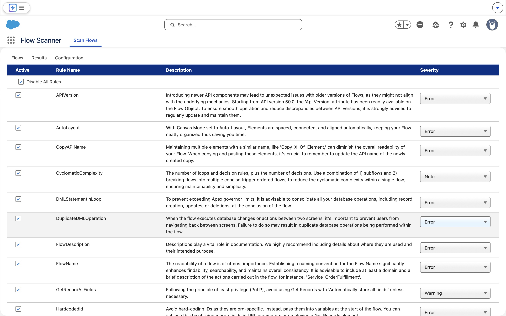

<p align="center">
 <a href="https://github.com/Flow-Scanner">
 
 </a>
</p>
<p align="center"><em>Detect unsafe contexts, queries in loops, hardcoded IDs, and more to optimize Salesforce Flows.</em></p>

<p align="center">
 
</p>

---

## Table of contents

- **[Usage](#usage)**
  - [App Screens](#app-views(tabs))
  - [User Manual](#user-manual)
- **[Configuration](#configuration)**
- **[Installation](#installation)**
- **[Development](#development)**

---

## Usage

**Lightning Flow Scanner App** integrates the Lightning Flow Scanner as a UMD module within Salesforce, enabling scanning of flow metadata for 20+ issues such as hardcoded IDs, unsafe contexts, inefficient SOQL/DML operations, recursion risks, and missing fault handling.

For details about all available rules, their default severities, and configuration options, visit the [Flow Scanner Documentation](https://flow-scanner.github.io/lightning-flow-scanner-core/).

### App Views(Tabs)

#### Flow Overview

<p align="center">
 
</p>

#### Violation Details

<p align="center">
  
</p>

#### Rule Configuration:

<p align="center">
 
</p>

### User Manual

- Click on the App Launcher icon in the top-left corner of your Salesforce interface.
- Search for "Flow Scanner" in the App Launcher.
- Click on the "Flow Scanner" app to open the Scan Flows Overview.
- (Optional) Configure rules in the Configuration tab.
- View results of a Flow by clicking "details".

**Privacy:** Zero user data collected. All processing is client-side. → See Data Handling in our [Security Policy](https://github.com/Flow-Scanner/lightning-flow-scanner-app?tab=security-ov-file).

---

## Configuration

While no configuration is required, Admins can define **default severities**, **expressions**, or **disabled states** for scan rules using the `ScanRuleConfiguration__mdt` custom metadata type. These overrides apply globally for all users in the org, but individual users can still adjust severities or disable rules locally in the browser — those changes only persist for their current session. For a more on configurations, review the [documentation](https://flow-scanner.github.io/lightning-flow-scanner-core/#configurations).

1. Go to **Setup → Custom Metadata Types → ScanRuleConfiguration → Manage Records**
2. Click **New** and set the following fields:

- **Rule Name** — must match the rule’s API name (e.g., `FlowName`)
- **Severity** — `Error`, `Warning`, `Info`, or `Note`
- **Expression** *(optional)* — e.g., `[A-Za-z]+_[0-9]+`
- **Disabled** — check to turn off the rule globally

3. Once saved, the **Flow Scanner App** automatically applies these overrides at load time — no user configuration needed.

<p align="center">
 
</p>

---

## Installation

| Deployment Type | Installation |
|-----------------|----------------|
| **Managed** (Recommended) | <a href="https://login.salesforce.com/packaging/installPackage.apexp?p0=04tgK0000007M73QAE"></a> |
| **Unmanaged** | <a href="https://githubsfdeploy.herokuapp.com?owner=Flow-Scanner&repo=lightning-flow-scanner-app&ref=main"></a> |
| **Or via CLI** | `sf package install --package 04tgK0000007M73QAE --wait 10` |

> After installation, complete the [Post-Installation Setup](docs/installation.md) to configure the Connected App and assign permissions.

---

## Development

1) Clone this repository:

```sh
git clone https://github.com/Flow-Scanner/lightning-flow-scanner-app.git
```

2) Create a Scratch Org

```sh
sf org:create:scratch --definition-file config/project-scratch-def.json --alias FlowScanner --duration-days 7 --set-default --json
```

3) Push Source to Your Org:

```sh
sf project:deploy:start
```

4) Assign Permission Set

```sh
sf org assign permset --name Flow_Scanner
```

<p><strong>Want to help improve Lightning Flow Scanner? See our <a href="https://github.com/Flow-Scanner/lightning-flow-scanner-core?tab=contributing-ov-file">Contributing Guidelines</a></strong></p>
